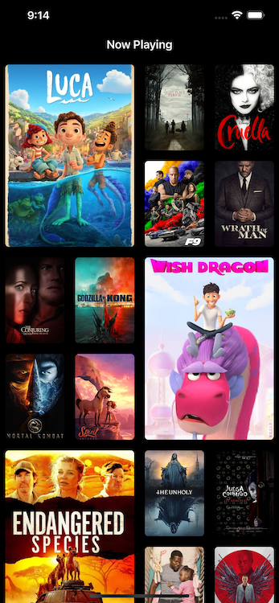
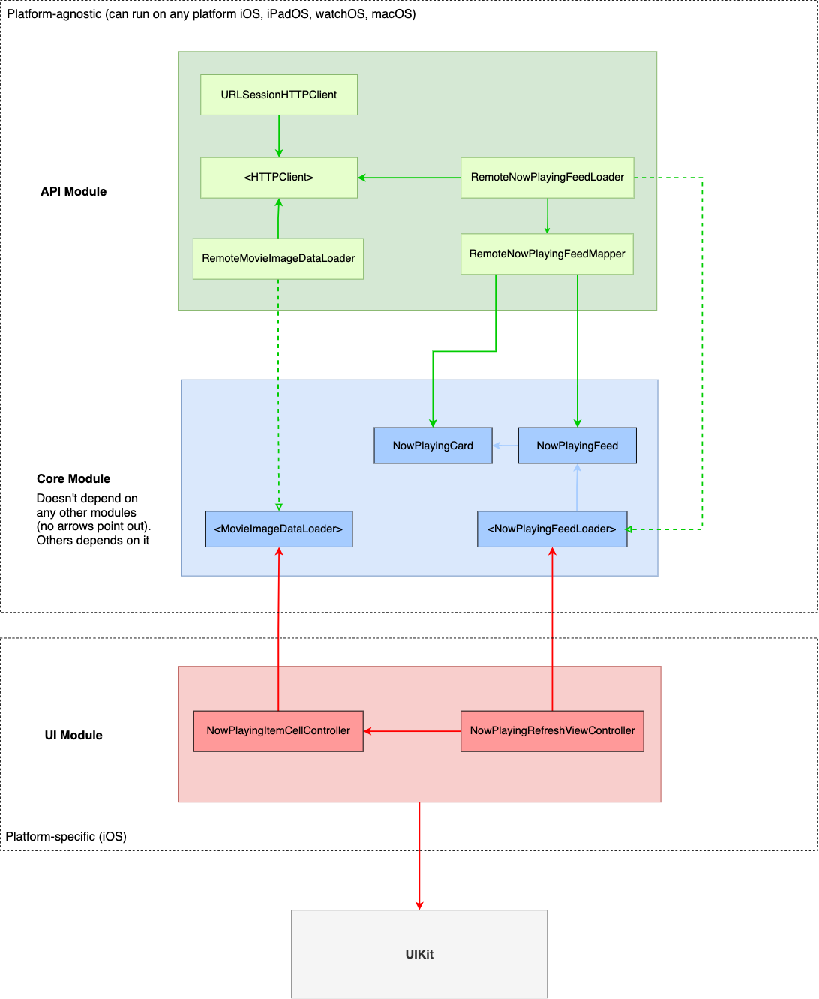

# Movies iOS Application

⚠️ This pet project is still under development. I create this project mainly to practice TDD and testing skills. You can also clone the project to see how I use TDD to build features.

⚠️ This project uses APIs from: https://www.themoviedb.org/ 

#

## Feed UI

## Architecture (MVC Implementation)

### Use Case Specs

#### Load Now Playing Feed From Remote
Data:
- URL
- page
- api key

Primary course (happy path):
1. Execute `load` command with above data.
2. System downloads data from remote.
3. System validates the downloaded data.
4. System creates feed item from validated data.
5. System delivers feed item.

Client error - error course (sad path):
1. System delivers connectivity error.

Invalid data error - error course (sad path):
1. System delivers invalid data error.

#### Load Now Playing Item Data From Remote
Data:
- URL

Primary course (happy path):
1. Execute `load now playing item image data` command with above data.
2. System downloads data from remote.
3. System validates the downloaded data.
5. System delivers feed image data.

#### Cancel course:
1. System does not deliver image data nor error.

#### Invalid data – error course (sad path):
1. System delivers invalid data error.

#### Client error - error course (sad path):
1. System delivers connectivity error.
